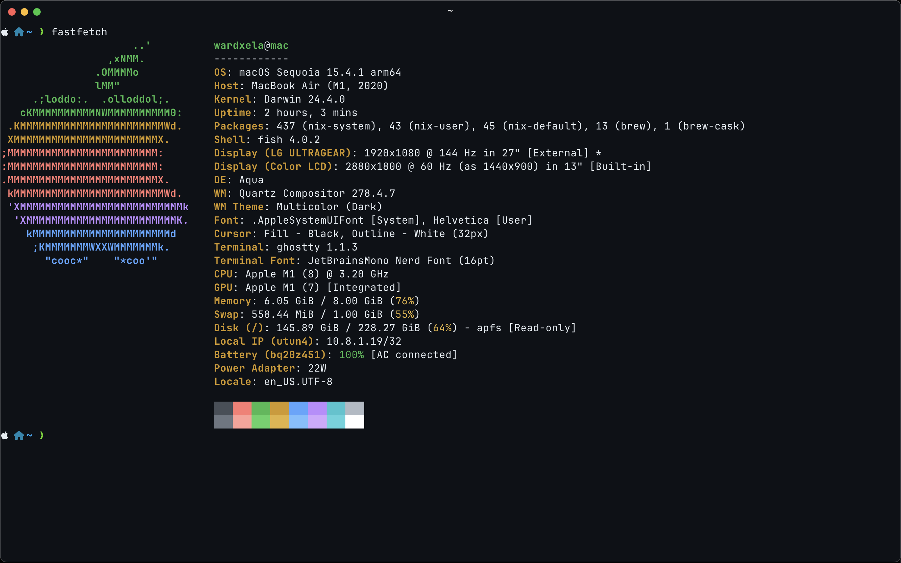
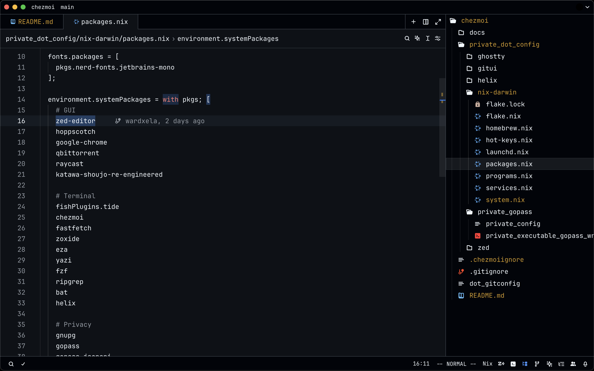
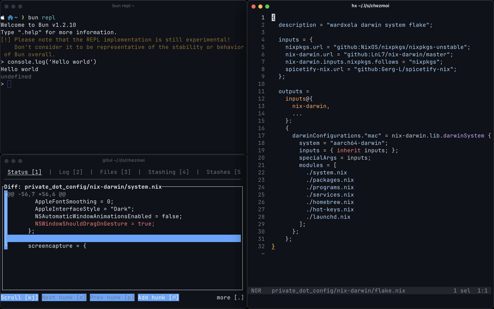
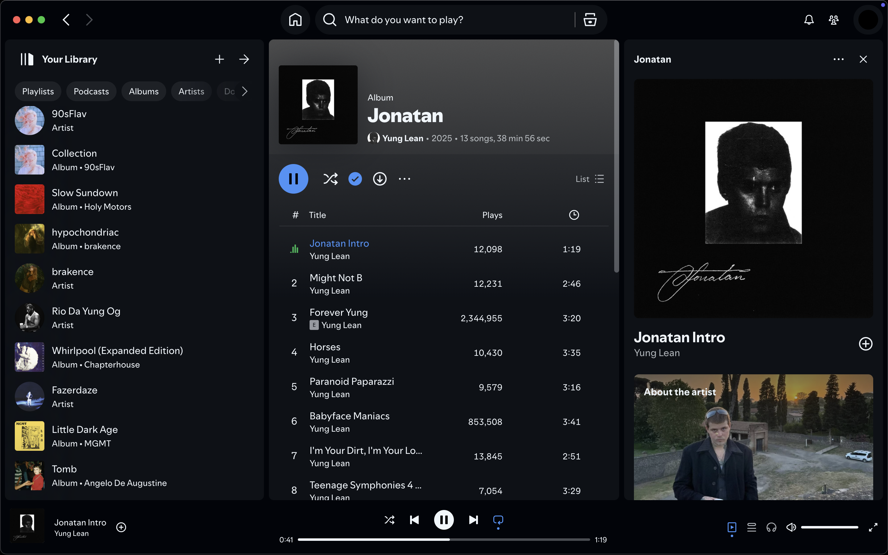

# wardxela's dotfiles

## Features

- Declarative configuration powered by [Nix](https://nixos.org/)
- Easy to install & update with [chezmoi](https://www.chezmoi.io/)
- Fully configured MacOS. Essential features include:
  - Tweaked Dock, Finder and other system preferences
  - Enabled [AeroSpace](https://github.com/nikitabobko/AeroSpace) window manager
  - `Caps Lock` key is bound for language switching without delay. Read my article
  ["Caps Lock sucks on MacOS"](https://telegra.ph/Test-02-22-369) for more details
- Installed and configured essential development tools
- Most of the apps are using [Github Dark Theme](https://github.com/PyaeSoneAungRgn/github-zed-theme)

## Progress:

- [x] Chezmoi + GoPass
- [ ] Remove chezmoi, use only nix
- [ ] Add support for Linux
- [ ] Installation guide

## Screenshots

Editor

Terminal

Spotify

